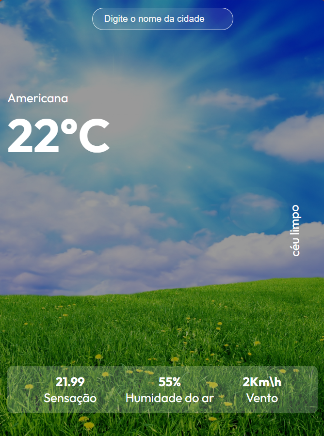

# TEMPO-APP


> Projeto de uma aplicação de previsão do tempo para estudos em REACT.




## Pré-requisitos 

Antes de começar, certifique-se de ter o seguinte instalado em sua máquina:

- Node.js (versão 14 ou superior) 
- npm (gerenciador de pacotes do Node.js)

## Instalação 
Siga os passos abaixo para configurar e executar o projeto localmente:
 1. **Clone o repositório**: ```bash git clone https://github.com/Vinicius149/tempo-app.git cd tempo-app ``` 
 2. **Instale as dependências**: ```bash npm install ``` 
 3. **Crie um arquivo `.env` na raiz do projeto e adicione sua chave de API**: ```plaintext REACT_APP_API_KEY=your_api_key_here ``` 
 4. **Execute o projeto**: ```bash npm start ``` 
 5. **Abra o navegador e acesse**: ```plaintext http://localhost:3000 ``` 
 ## Estrutura do Projeto
  - `public/`: Contém arquivos estáticos e o arquivo `index.html`. 
  - `src/`: Contém os arquivos de código-fonte do React. - `App.js`: Componente principal do aplicativo. 
  - `index.js`: Ponto de entrada do React. 
  - `index.css`: Estilos globais do aplicativo. 
  ## Funcionalidades - Busca de previsão do tempo por cidade. 
  - Exibição de temperatura, sensação térmica, umidade e velocidade do vento. 
 
  ## Contribuindo 
  Para contribuir com o projeto, siga estas etapas: 
  1. Bifurque este repositório. 
  2. Crie um branch: `git checkout -b <nome_branch>`. 
  3. Faça suas alterações e confirme-as: `git commit -m '<mensagem_commit>'`. 
  4. Envie para o branch original: `git push origin <nome_do_projeto>/<local>`. 
  5. Crie uma solicitação de pull. 
  
  ## Licença Este projeto está sob a licença MIT. Veja o arquivo [LICENSE](LICENSE) para mais detalhes.